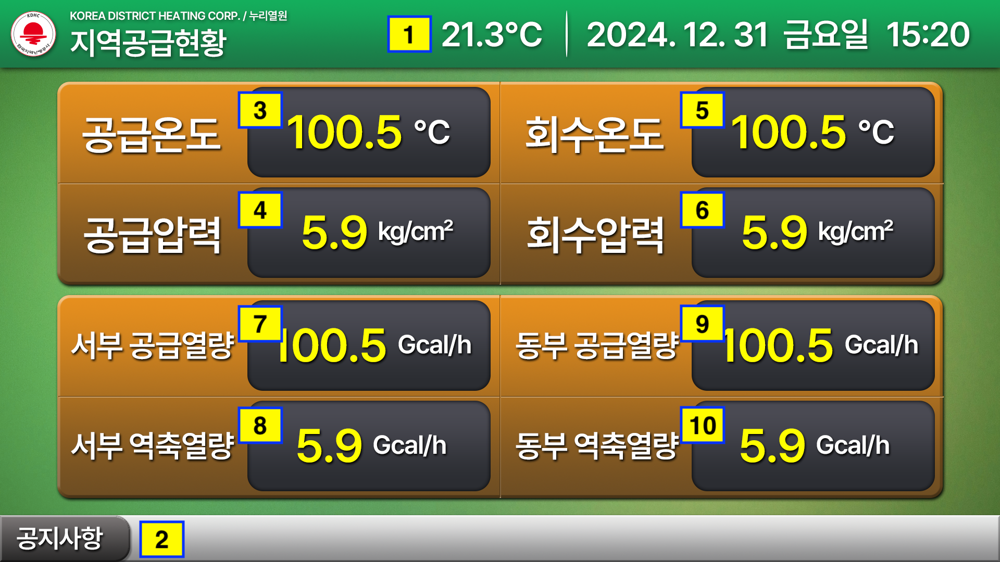

# Data Interface

### #Page1 지역공급현황

| 번호 | 데이터 | 포맷 | 단위 |
|---|---|---|---|
| 1 | 기온 | 00.0 | ℃ |
| 2 | 공지사항 | - | - |
| 3 | 공급온도 | 000.0 | ℃ |
| 4 | 공급압력 | 000.0 | kg/cm² |
| 5 | 회수온도 | 000.0 | ℃ |
| 6 | 회수압력 | 000.0 | kg/cm² |
| 7 | 서부 공급열량 | 000.0 | Gcal/h |
| 8 | 서부 역축열량 | 000.0 | Gcal/h |
| 9 | 동부 공급열량 | 000.0 | Gcal/h |
| 10 | 동부 역축열량 | 000.0 | Gcal/h |`