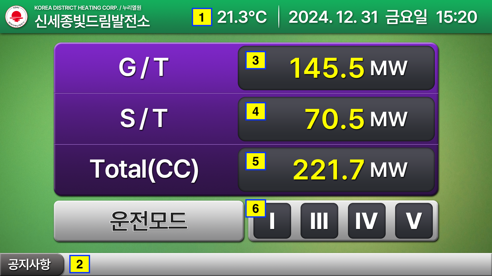

# Data Interface

### #Page2 신세종빛드림발전소

| 번호 | 데이터 | 포맷 | 단위 |
|---|---|---|---|
| 1 | 기온 | 00.0 | ℃ |
| 2 | 공지사항 | - | - |
| 3 | G/T | 000.0 | MW |
| 4 | S/T | 000.0 | MW |
| 5 | Total(CC) | 000.0 | MW |
| 6 | 운전모드 | 0000 | - |