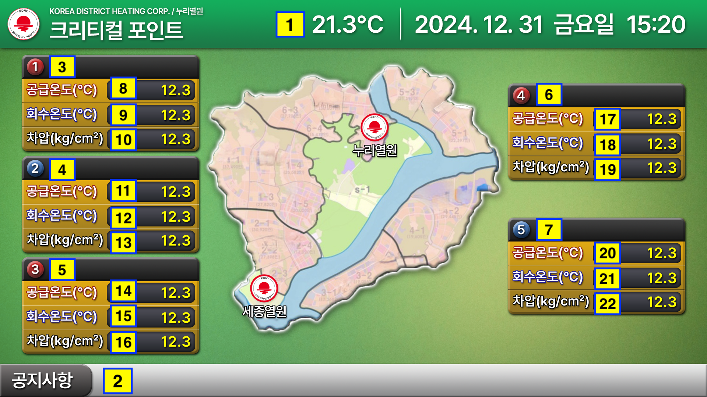

# Data Interface

### #Page4 크리티컬 포인트

| 번호 | 데이터 | 포맷 | 단위 |
|---|---|---|---|
| 1 | 기온 | 00.0 | ℃ |
| 2 | 공지사항 | - | - |
| 3 | 1번 지역 | - | - |
| 4 | 2번 지역 | - | - |
| 5 | 3번 지역 | - | - |
| 6 | 4번 지역 | - | - |
| 7 | 5번 지역 | - | - |
| 8 | 1번 공급온도 | 000.0 | - |
| 9 | 1번 회수온도 | 000.0 | - |
| 10 | 1번 차압 | 000.0 | - |
| 11 | 2번 공급온도 | 000.0 | - |
| 12 | 2번 회수온도 | 000.0 | - |
| 13 | 2번 차압 | 000.0 | - |
| 14 | 3번 공급온도 | 000.0 | - |
| 15 | 3번 회수온도 | 000.0 | - |
| 16 | 3번 차압 | 000.0 | - |
| 17 | 4번 공급온도 | 000.0 | - |
| 18 | 4번 회수온도 | 000.0 | - |
| 19 | 4번 차압 | 000.0 | - |
| 20 | 5번 공급온도 | 000.0 | - |
| 21 | 5번 회수온도 | 000.0 | - |
| 22 | 5번 차압 | 000.0 | - |