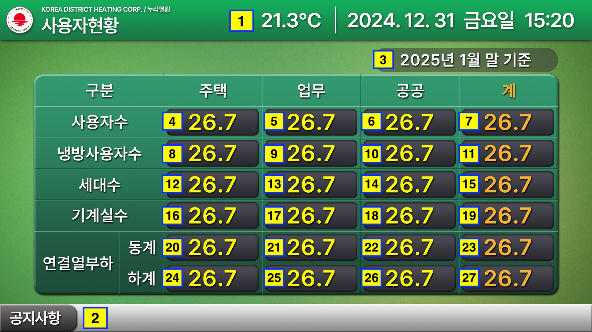

# Data Interface

### #Page5 사용자현황

| 번호 | 데이터 | 포맷 | 단위 |
|---|---|---|---|
| 1 | 기온 | 00.0 | ℃ |
| 2 | 공지사항 | - | - |
| 3 | 기준날짜 | - | - |
| 4 | 사용자수-주택 | 000 | - |
| 5 | 사용자수-업무 | 000 | - |
| 6 | 사용자수-공공 | 000 | - |
| 7 | 사용자수-계 | 000 | - |
| 8 | 냉방사용자수-주택 | 000 | - |
| 9 | 냉방사용자수-업무 | 000 | - |
| 10 | 냉방사용자수-공공 | 000 | - |
| 11 | 냉방사용자수-계 | 000 | - |
| 12 | 세대수-주택 | 000 | - |
| 13 | 세대수-업무 | 000 | - |
| 14 | 세대수-공공 | 000 | - |
| 15 | 세대수-계 | 000 | - |
| 16 | 기계실수-주택 | 000 | - |
| 17 | 기계실수-업무 | 000 | - |
| 18 | 기계실수-공공 | 000 | - |
| 19 | 기계실수-계 | 000 | - |
| 20 | 연결열부하(동계)-주택 | 000.0 | - |
| 21 | 연결열부하(동계)-업무 | 000.0 | - |
| 22 | 연결열부하(동계)-공공 | 000.0 | - |
| 23 | 연결열부하(동계)-계 | 000.0 | - |
| 24 | 연결열부하(하계)-주택 | 000.0 | - 
| 25 | 연결열부하(하계)-업무 | 000.0 | - |
| 26 | 연결열부하(하계)-공공 | 000.0 | - |
| 27 | 연결열부하(하계)-계 | 000.0 | - |